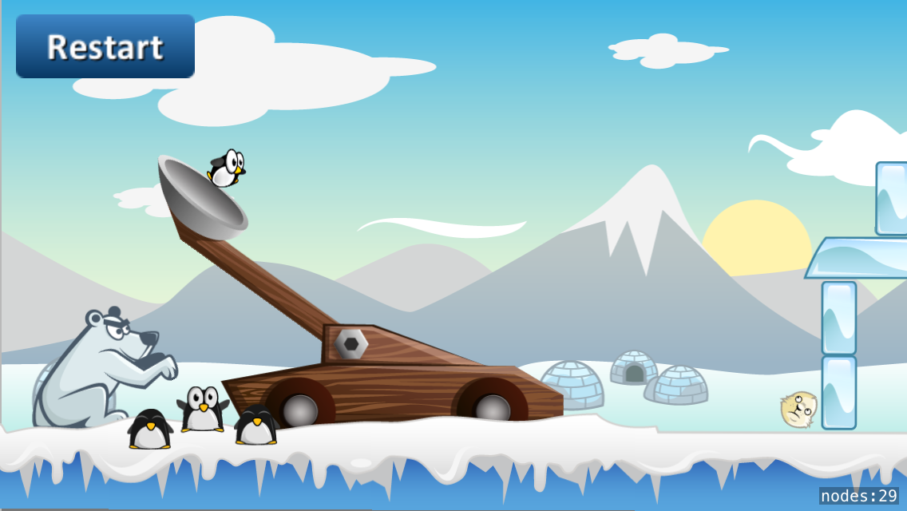

In this tutorial we will build Peeved Penguins -- a clone of the classic mobile game [Angry Birds](https://itunes.apple.com/us/app/angry-birds/id343200656?mt=8). We will use Apple's Swift programming language together with SpriteKit their game development framework.

#What you will learn

Throughout this tutorial you will learn many concepts including how to:

- Switch scenes from main menu to gameplay
- Create a camera to follow the action
- Using the SpriteKit physics engine
- Utilizing physics joints to model a catapult
- Load levels from SKS files
- Use the timeline to create character animations
- Make a game that is compatible with both iPhone and iPad
- Texture atlas and performance optimization

#The finished product

We'll be making a basic clone of Angry Birds with a catapult launcher and seal enemies. The final game will look like this:

#Feedback

If you have feedback on this tutorial or find any mistakes, please open issues on the [GitHub Repository](https://github.com/MakeSchool-Tutorials/Peeved-Penguins-SpriteKit-Swift).
