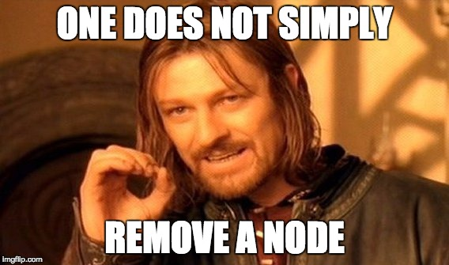

Next you'll learn how to setup your physics simulation to notify you of certain events.  You want to be able to remove seals from the game when they are hit by penguins, ice blocks or even each other.

# Contact delegate

What you as developer need to do is to add *meaning* to different kinds of collisions. In the game a meaningful collision is one between a *seal* and **any** other object in the game.

In SpriteKit you can do this by implementing the *SKPhysicsContactDelegate*. Let's implement this protocol in the *GameScene* class, so your code will be notified when a meaningful collision takes place.

> [action]
> Modify the *GameScene* class declaration:
>
```
class GameScene: SKScene, SKPhysicsContactDelegate {
```
>

Now that you've adopted the *SKPhysicsContactDelegate* protocol, you need to sign up your class to receive events generated by the physics contact delegate.

> [action]
> Add this code to `didMove(...)`:
>
```
/* Set physics contact delegate */
physicsWorld.contactDelegate = self
```
>

# Physics masks

In SpriteKit each *physicsBody* has a property called *categoryBitMask*. This category is typically used to identify different participants in a collision.

You remember that you setup the penguin with a **Category Mask** of `1` and the seal with `2`. When a collision takes place you will be checking both bodies *categoryBitMask* for a value of `2` to identify if a seal has been involved in the collision.

By default SpriteKit will not notify you of any collisions, I'm sure you've spotted the *Contact Mask* property when setting up physics bodies.  By default the value is `0` so although collisions will still physically take place, the *contactDelegate* will never be informed unless we modify the mask to enable notification.

Your use case is straightforward, if **anything** collides with a seal you want to know about it.

If you look back at the setup of the *Seal.sks* you set the *Contact Mask* to be `1` in preparation of this
requirement.

# Implementing protocol

You will need to implement the *beginContact(...)* method that will inform you of any meaningful collision contacts. You need to grab a reference first of all to the *SKPhysicsBodies* involved in the collision. This gives you access to important information such as the *categoryBitMask*, so you can check if this body is a seal.

> [action]
> Add this method to the *GameScene* class:
>
```
func didBegin(_ contact: SKPhysicsContact) {
  /* Physics contact delegate implementation */
>
  /* Get references to the bodies involved in the collision */
  let contactA:SKPhysicsBody = contact.bodyA
  let contactB:SKPhysicsBody = contact.bodyB
>  
  /* Was there a seal involved in the collision ? */
  if contactA.categoryBitMask == 2 || contactB.categoryBitMask == 2 {
      print("Seal Hit")
  }
}
```
>

Run your game...

Watch the *Debug Panel* for log messages. You may notice you get a few **Seal hit** messges when the level loads. Currently this code is super sensitive, the act of adding *Level1.sks* to the scene will typically generate a contact event as the seal ever so gently touches the ground or a block when it's first added to the scene.

# Sensitivity

Now that you know that the collision handler is working, let's improve the implement it. What you want is a way to check how hard the seal was hit and use that to check if you should **ignore the collision** or **destroy the seal**.  

SpriteKit to the rescue, you can access the *collisionImpulse* property of the collision to inform you hard these bodies struck each other.

To keep things clean let's add a seal removal method. You'll be adding additional functionality to this method later.

> [action]
> Replace the `didBegin` method with the following:
>
```
func didBegin(_ contact: SKPhysicsContact) {
/* Physics contact delegate implementation */
>
/* Get references to the bodies involved in the collision */
let contactA:SKPhysicsBody = contact.bodyA
let contactB:SKPhysicsBody = contact.bodyB
>
/* Get references to the physics body parent SKSpriteNode */
let nodeA = contactA.node as! SKSpriteNode
let nodeB = contactB.node as! SKSpriteNode
>
  /* Was a seal involved? */
  if contactA.categoryBitMask == 2 || contactB.categoryBitMask == 2 {
>
      /* Was it more than a gentle nudge? */
      if contact.collisionImpulse > 2.0 {
>
          /* Kill Seal(s) */
          if contactA.categoryBitMask == 2 {
              dieSeal(nodeA)
          }
          if contactB.categoryBitMask == 2 {
              dieSeal(nodeB)
          }
      }
  }
}
```
>

You will notice Xcode will popup with an error.  That's because you havn't got a `dieSeal` method, don't worry, you will be implementing this in the next step.

## Removing the seal

> [action]
> Add the *dieSeal* method to your *GameScene* class:
>
```
func dieSeal(_ node: SKNode) {
  /* Seal death*/
>
  /* Create our seal removal action */
  let sealDeath = SKAction.removeFromParent()
  node.run(sealDeath)
}
```
>

This code should be fairly familiar, notice you are using a *SKAction* to remove the node rather than calling the `removeFromParent` method directly.

> 

In the physics simulation you need to ensure that the seal is removed at correct step in the SpriteKit frame render cycle. There is a **post-physics** step called *didSimulatePhysics* that takes place after physics forces have been calculated and positions updated for the current frame.  At this point it's safe to remove a physics body.  However, if you remove a physics body too soon you will run into problems with the physics simulation trying to access nodes that have been prematurely removed. The result is a horrible game crash.  

By using the *SKAction*, SpriteKit will ensure it's removed when it's safe to do so.

# Summary

The game mechanic is nearly finished, you've learnt to:

- Implement the physics *SKPhysicsContactDelegate*
- Use the **categoryBitMask** to identify physics bodies in a collision
- Use **SKPhysicsContact** to evaluate the collision force between two bodies
- Remove the seal cleanly from the scene

In the next chapter it's time to add a little sparkle.
