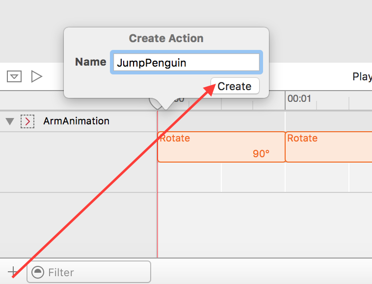
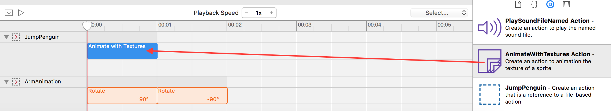
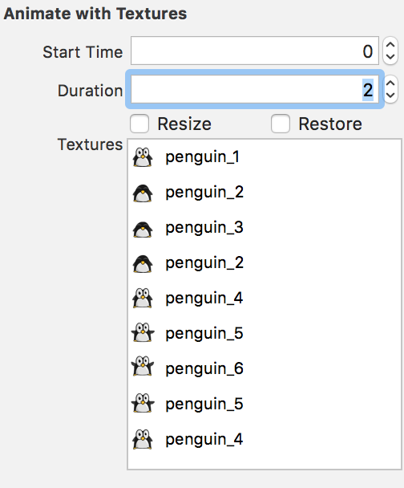
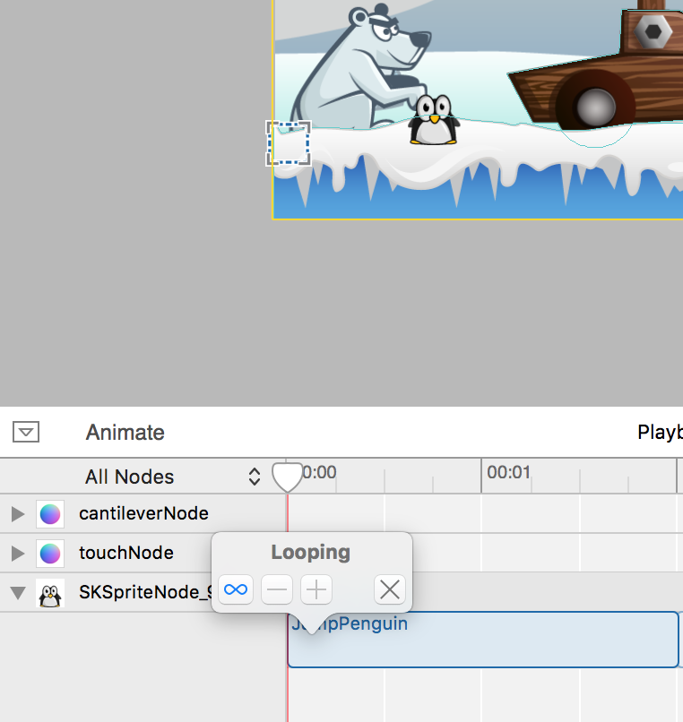
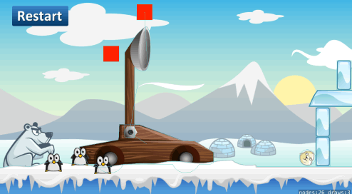

In an early chapter you already learned how to create an animation using the timeline features of SpriteKit (remember the bear?). In this chapter you will learn how to create a sprite frame animation, using a series of sprite files. You will animate penguins to sit around the catapult, waiting for their turn to make history and fly.

# Animation action

You're going add this new penguin animation action to the SpriteKit actions file, *Actions.sks*.

> [action]
> Select *Actions.sks* and `Add` a new action, name it `JumpPenguin`.
>
> 
>

## Build the animation

> [action]
> The first thing you need to do is drag a *AnimateWithTextures* action into the `JumpPenguin` timeline.
> 
>

SpriteKit allows you to sequence the animation frames by dropping them into the *Textures* box.
The order for this animation will be *penguin_#* `1,2,3,2,4,5,6,5,4`.

> [action]
> Drag each of the *penguin_#.png* assets from the *Media Library* into the *Textures* box in the order show above.
> Set *Duration* to `2`
>
> It should look like this when you're finished.
> 
>

Great, you've made a `JumpPenguin` action. Time to apply this to the *GameScene*

# Adding Penguins

> [action]
> Drag a *waitingpenguin.png* asset into *GameScene.sks*
>
> Expand the timeline for this sprite and drag in the `JumpAction` action into the timeline.
>
> You will want to repeat the animation forever so set this action repeat to forever.
>
> 
>
> *Copy* and *Paste* this penguin two more times, placing them close to each other.
>

Run your game... You should see the three penguins blinking and jumping for joy next to the catapult:

# Desynchronize penguins

The animation looks pretty good. However, it seems unnatural that all three penguins perform the `JumpAction` at the exact same time. This happens because your timeline actions all start at zero, this means the animation starts as soon as the object enters the scene.

You improve this quite easily, click on each *JumpAction* in the timeline and modify the *Start Timer*, set it to `0` , `0.25` and `0.5` respectively for each node.

Remember you can preview this in Xcode by pressing *Animate* in the timeline.

Run your game... Looking good!

# Summary

Well done! You now have mastered sprite frame animations in SpriteKit.

In the next chapter you are going to polish the gameplay.
