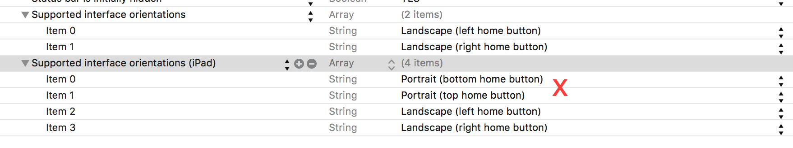
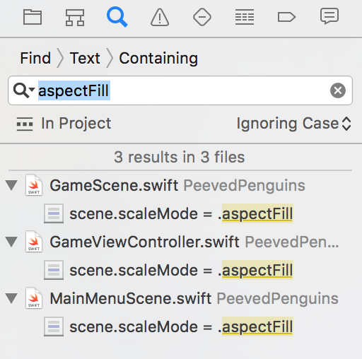

SpriteKit allows you to adapt your game for the iPad without having to supply new assets and only requires making a few small changes.

#iPad Tweaks

Try running your game on an iPad to see what happens...

You will most likely notice the following:

- The main menu is useable, although it looks zoomed in.
- The main game is unplayable.
- It's probably running in portrait mode!

Let's fix the orientation issue first, as this game should only ever be ran in landscape.

> [action]
> Open *info.plist* and expand the options at the bottom.
> Notice the *iPad orientation* options contain **Portrait** options, remove these.
>
> 

Run your game again, it should be landscape only now.

##Aspect

Currently you are using a scene *scaleMode* or `.AspectFill` which looks great on the iPhone.  However, for the iPad you can't see all of the game content.  Let's try another scale mode.

> [action]
> Switch to the *Find Navigator* tab and search for `AspectFill`
>
> 
>
> Replace all results of `.AspectFill` with `.AspectFit`
>

Run your game...

Looking better, the only minor point is the letterbox effect.  However, this is more than acceptable for the minimal amount of work required to achieve this compatibility.  Some games simply add a decoration border to fill this space.

Yet the *GameScene* does not look quite right.

Oh so close...

This is actually an easy fix, it helps if all nodes are centered correctly.

> [action]
> Open *GameScene.sks*, select the scene and set *Anchor point* to `(0.5,0.5)`

Run your game... YES! :]

#Summary

Congrats on finishing *Peeved Penguins*, give yourself or the person next to you a high five.

The next chapter will be a recap of everything you have covered so far, well done.
