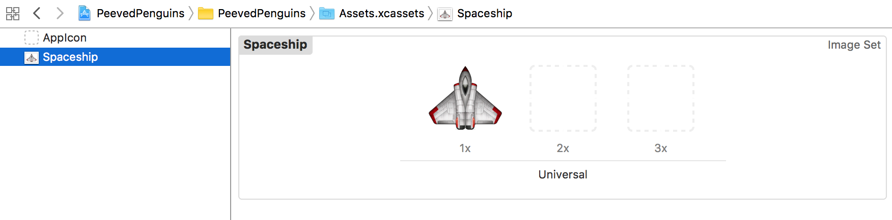
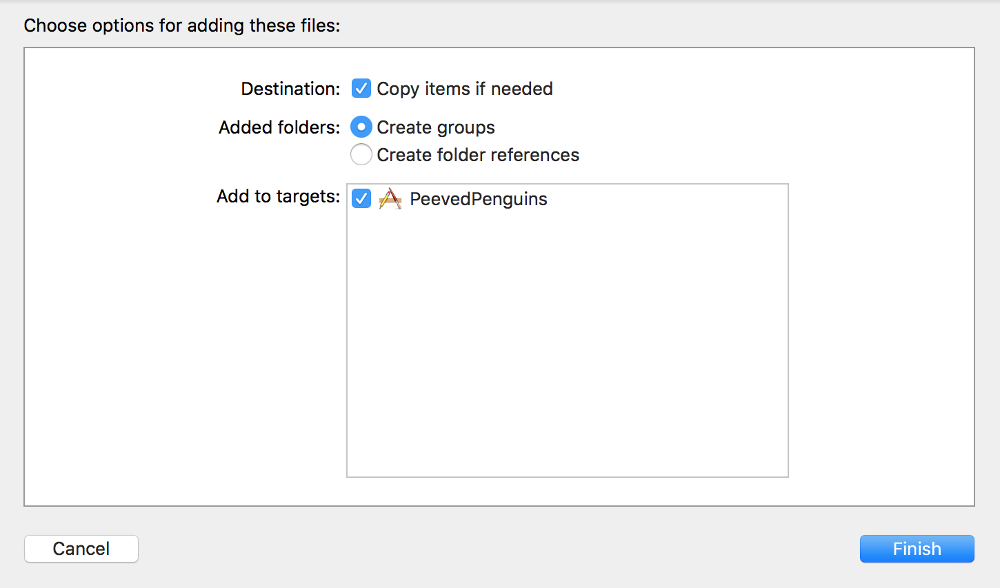

Let's get started with a new SpriteKit project and look at the benefits of using a *Texture Atlas*.

# Create a new project

> [action]
> Create a new project in Xcode named `PeevedPenguins`, set the *Language* to `Swift` and *Game Technology* is set to `SpriteKit`.
> 
>

Now download the [Peeved Penguins art pack](https://github.com/MakeSchool-Tutorials/Peeved-Penguins-SpriteKit-Swift/raw/master/PeevedPenguinsAssets.zip) we created for you. Once the download is complete, unpack the folder.

## Landscape

This game will use the landscape device orientation, you need to set this in the project otherwise it will default to portrait.

> [action]
> Click on your project (the top item in the *Project Navigator*)
> On the next screen, click on the *PeevedPenguins* target, ensure you are in the *General* tab and then uncheck the *Portrait* option as shown:
> 
>

## Project tidy

In every new game project, SpriteKit will include a *Spaceship* asset inside the `Assets.xcassets` folder.
You will not be needing it, so please remove it.
> [action]
> Select the SpaceShip asset and press backspace.
> 
>

### Cleaning up the template code

> [action]
> Replace the contents of *GameScene.swift* with:
>
```
import SpriteKit
>
class GameScene: SKScene {
>        
    override func didMove(to view: SKView) {
>        
    }
>        
    override func touchesBegan(_ touches: Set<UITouch>, with event: UIEvent?) {
>
    }
>    
    override func update(_ currentTime: TimeInterval) {
>
    }
}
```
>

# The Texture Atlas

The unpacked folder should be named `assets.atlas` the key here is the extension `.atlas`.  This lets Xcode know you want these assets to be converted into a *Texture Atlas*.  You will have noticed all of the assets use the '@2x' suffix to let Xcode know these are 2x retina assets.

> [info]
> What is a *Texture Atlas*? I'm glad you asked.
> In the Hoppy Bunny tutorial you added single assets to the project using `Assets.xcassets` this gives us great control over the assets however it is inefficient when it comes to game rendering performance.
>
> Imagine opening up your preferred image editing software and copy/pasting all of these single images into one larger image to hold them all. The immediate benefit would be instead of the app having to load in approximately 25 **PNG** files it now only has to load one **PNG**.  On today's devices this is a relatively small win. However, only a few iPhone generations ago this alone could give a nice little improvement to the loading time.  Every second counts when it comes to holding your players attention.
>
> The bigger benefit is realized during the rendering of the  game scene. Every time (ideally 60 times per second) your *Assets* (or *Sprites*) need to be displayed on screen, the rendering engine must go to texture memory where the sprite is stored and render this into the frame buffer.  There is a performance cost to switching textures, this can be negated by the use of the *Texture Atlas*, instead of having to switch textures 25 times, 60 times a second.  The rendering engine can now render 25 different sections from *one* texture to render the scene and improve performance! You will find a *Texture Atlas* may also be referred to as a *Sprite Sheet*.

Time to import our assets.

> [action]
> Drag the `assets.atlas` folder into your project.
> Ensure `Copy items if needed` and `Create groups` are checked.
> 

## One big texture

So where is the big texture that is made from all of the images in the *assets.atlas* folder?
Xcode will combine and generate a single *Texture Atlas* from all of the assets when the project is built.

# Summary

Xcode makes it easy to create a *Texture Atlas* or *Sprite Sheet* as they are often called. This simple technique is very effective in improving game performance and you should always use it in any scene with more than a handful of assets.

In the next chapter you will learn to use the timeline and animate game objects.
