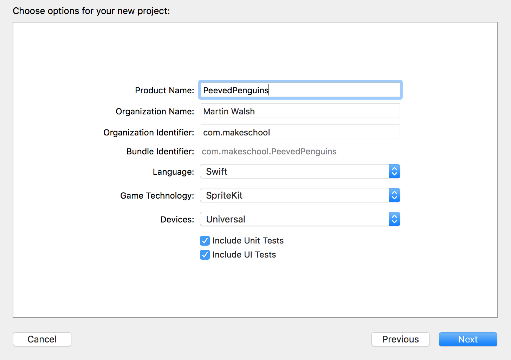
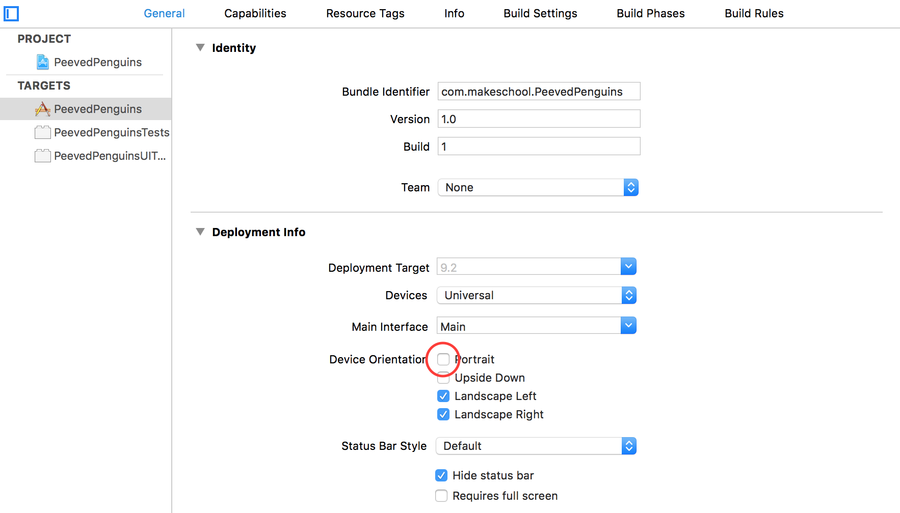

Let's get started with a new SpriteKit project and explore performance optimization,

#Create a new project

> [action]
> Create a new project in Xcode named `PeevedPenguins` and check the *Language* is set to `Swift` and *Game Technology* is set to `SpriteKit`.
> 

Now download the [Peeved Penguins art pack](../PeevedPenguinsAssets.zip) we created for you. Once the download is complete, unpack the folder.

##Landscape

This game will use the landscape device orientation, we need to set this in our project otherwise it will default to portrait.  Thankfully this is really easy to do.

> [action]
> Click on your project (the top item in the *Project Navigator*)
> On the next screen, click on the *PeevedPenguins* target, ensure you are in the *General* tab and then untick the *Portrait* option as shown:
> 
>

#Importing resources

Rename the unpacked folder to `assets.atlas`, the key here is the extension `.atlas`.  This lets Xcode know we want these assets to be converted into a *Texture Atlas*.  You will have noticed all of the assets use the '@2x' suffix to let Xcode know these are retina assets.

> [info]
> What is a *Texture Atlas*?
> In the Hoppy Bunny tutorial we added single assets to our project using `Assets.xcassets` this gives us great control over
our assets however it is inefficient when it comes to performance.
> Imagine opening up your preferred image editing software and copy/pasting all of these single images into one larger image to hold them all. The immediate benefit would be instead of your app having to load in say 25 png files it now only has to load one.  On today's devices this is a small win however only a few iPhone generations ago this alone could give a nice little improvement to your app load time.
>
> The bigger benefit is realized during the rendering of your game scene. Every time (typically 60 times per second) your *Assets* (or *Sprites*) need to be displayed on screen, the rendering engine must go to texture memory where the sprite is stored and render this into the frame buffer. There is a performance cost to switching textures, this can be negated by the use of the *Texture Atlas*, instead of having to switch textures 25 times, 60 times a second.  The rendering engine can now render 25 different sections from *one* texture to render the scene and improve performance! You will find a *Texture Atlas* is also often referred to as a *Sprite Sheet*.

Time to import our assets.

> [action]
> Drag the `assets.atlas` folder into your project.
> Ensure `Copy items if needed` is selected and `Create groups`.

Where is this big texture?
Xcode will generate a *Texture Atlas* from all of the assets in the new folder, when the project is built

#Summary

Xcode makes it very easy to create our *Texture Atlas or Sprite Sheet*, this simple technique is very effective in improving
game performance and you should always try and utilize it.

Let's move on and learn how to create animations with SpriteKit!
