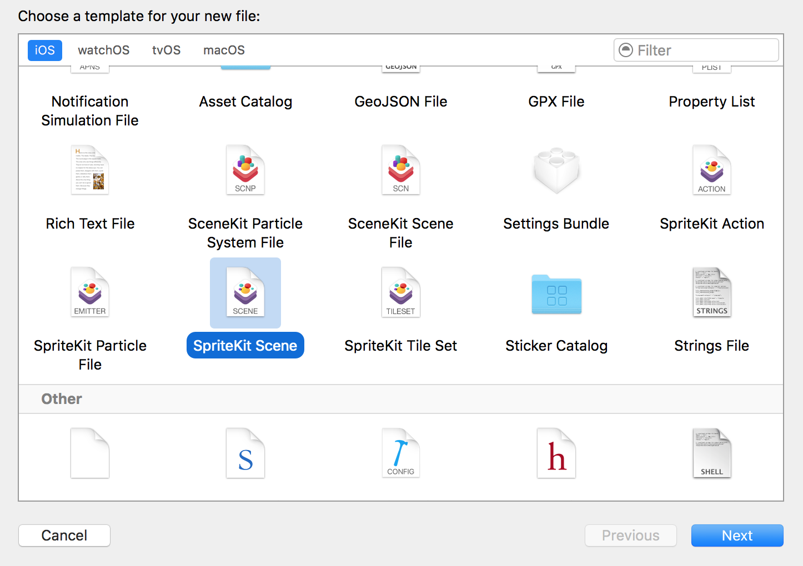
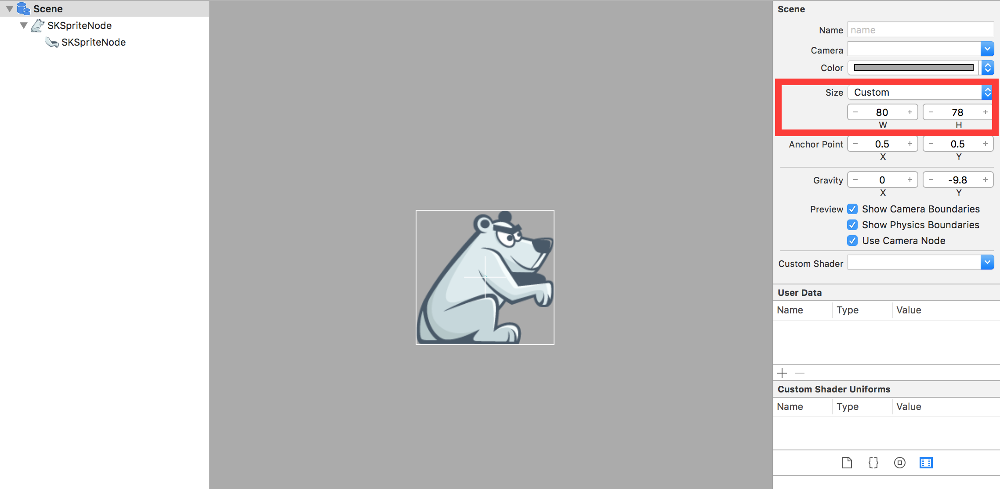
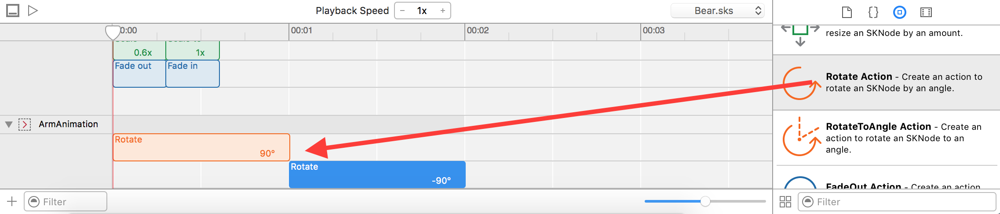

Let's learn how to create animations with SpriteKit's timeline. You are going to add a taunting animation to the polar bear that will sit behind the catapult:

# Build a bear

The bear will need its own `.sks` file.

> [action]
> Create a new file called *Bear.sks* (`File > New > File`) in your project:
>
> 

You will need to combine two images to construct the bear, the body without an arm and a separate arm that will be animated with the timeline.

> [action]
> Select *Bear.sks* and `Zoom Out` the scene so you can see the scene border.
> Drag *bearnoarms.png* in from your *Media Library* to the scene, **snap** it to the bottom left corner of the scene.
>
> 

<!--  -->

> [action]
> Add *beararm.png* to the scene, then set the *Anchor Point* to `(0,1)`, position it somewhere that looks good.
> Next in the *Scene Graph* view on the left hand side of the scene.  Drag the `arm` onto the `bear` so the `arm` is a child of the `bear`.
>
> 

You needed to set the anchor point of the arm because you are going to rotate it. When you apply a rotation to a *SKNode* it will rotate around the *Anchor Point*, the default is `(0.5,0.5)` this means it will rotate around the center point.  Now for the arm, you want to rotate somewhere around the shoulder, which in this case is the `Top-left` corner of the arm.

## Scene size

You may have noticed the large scene border around the bear, seems a bit of a waste? Let's resize this to reflect the size of the bear.  It's important to set the scene size appropriately otherwise it can lead to unexpected placement issues. Let's correct this.

> [action]
> Select *Scene* in the *Scene Graph*, in the *Attributes inspector* set the *Size* to `Custom`, *W* to `80` and *H* to `78`.  You may recall this is the same *Size* as the bear asset.
> If you resized and can't see the scene boundary, `Zoom-Out`.  
> You may also need to reposition the bear back into the scene boundary.
> 

> [info]
> Notice that when you drag the bear, the arm also moves along as it's a child node and any movement to the parent node (bear) will affect any child nodes.

# Animation timeline

Now you are ready to animate the polar bear's arm. Let's take a look at the scene *Timeline*.

> [action]
> Ensure the *Timeline* is visible
> 

## Add a new action

> Click on *+* to add a new timeline set *Name* to `ArmAnimation`, you will notice by default it will add this new animation to `Action.sks` the *SpriteKit Action File* included by the default game project.
>
> 
>
> `Open` *Actions.sks*, you will notice there are two actions.  The `ArmAnimation` you just added and one called `Pulse`.  Don't delete it, you might use it later :]

## Building the animation

You will be animating the arm using two *Rotate Actions*, the first one will rotate the arm by `90` degrees and the second will rotate it back again by `90` degrees, creating a nice loop.

> [action]
> Drag a *Rotate Action* from the *Action Library* into the `ArmAnimation` action timeline. The default attributes will work just fine.
> Drag a second *Rotate Action* into the timeline and set *Degrees* to `-90`.
>
> 

Congratulations! Let's see this animation in action!

## Applying actions

> [action]
> `Open` *Bear.sks*, take a look in the *Object Library* you should see your custom action `ArmAnimation` near the bottom of the list.  Drag this action into the arm timeline.
>
> 
>
> Next let's ensure this animation loops forever, `click` on the *Loop* button in the bottom-left of the **ArmAnimation** action and check the infinity symbol.
>
> 
>

Great job, press *Animate* at the top of the timeline editor and your bear should hopefully look like this:

# Summary

You've learnt to:

- Create a new SpriteKit Scene for the bear
- Create a custom `ArmAnimation` action in a SpriteKit Action file
- Apply your custom action to the bear timeline

In the next chapter you will be creating more game objects, ready for use in the game.
