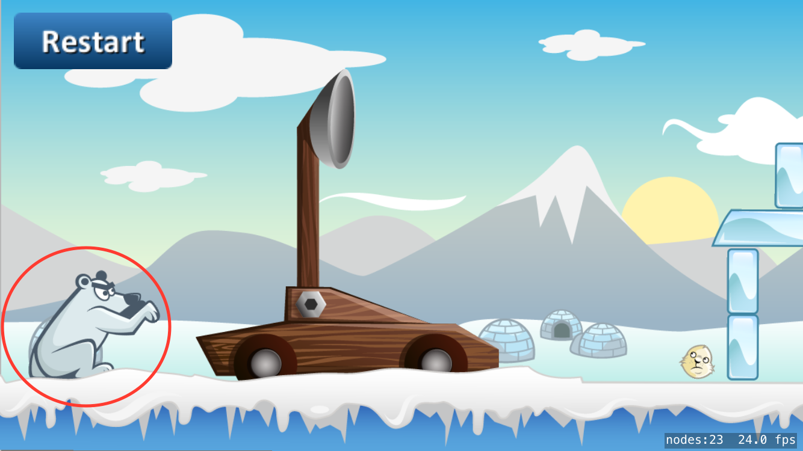
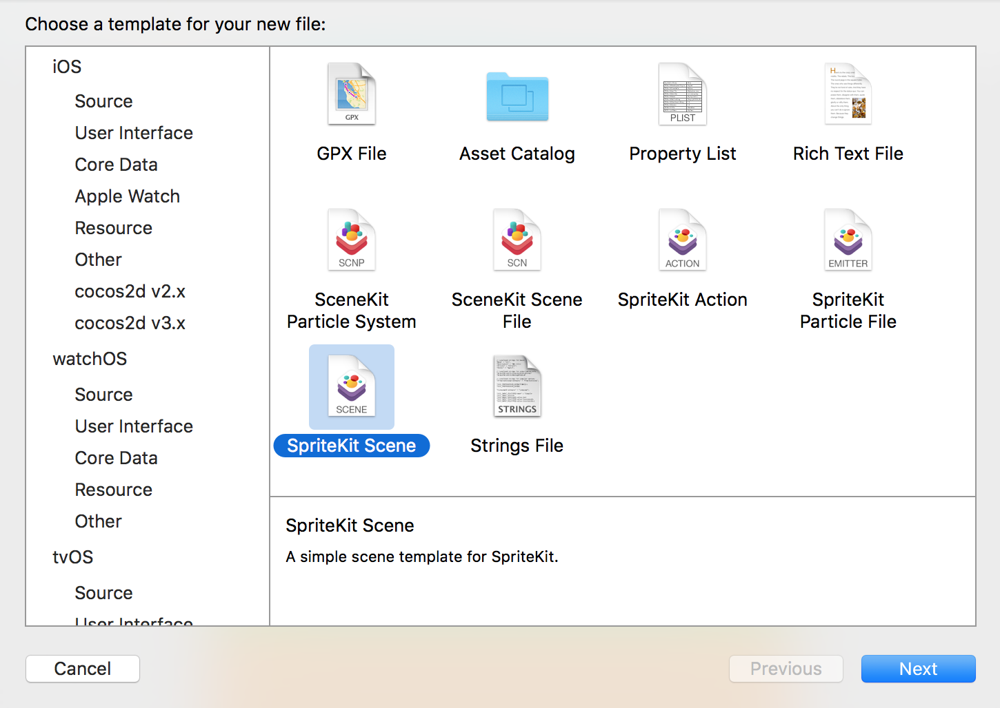
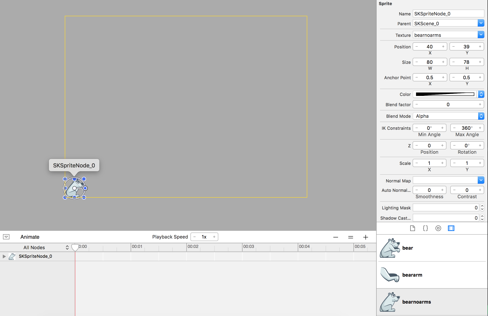
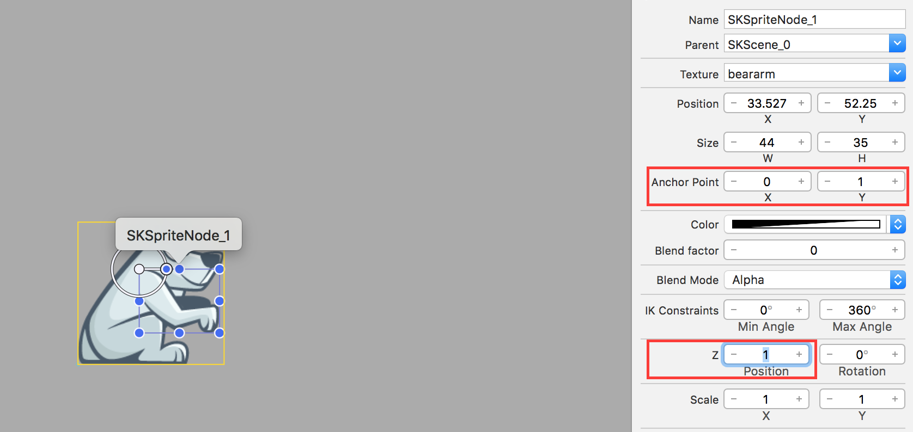
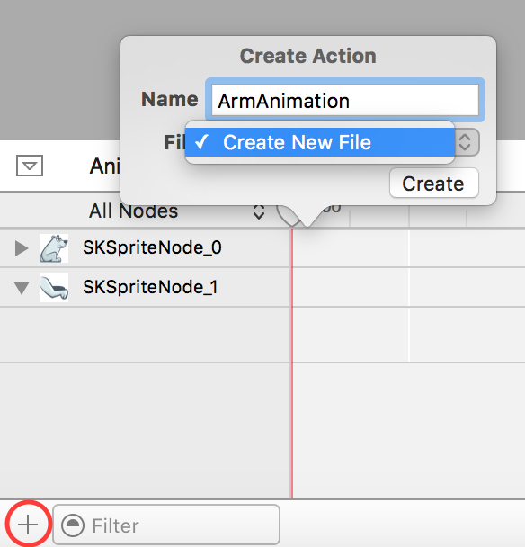
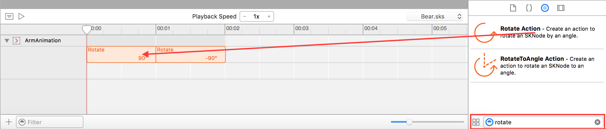
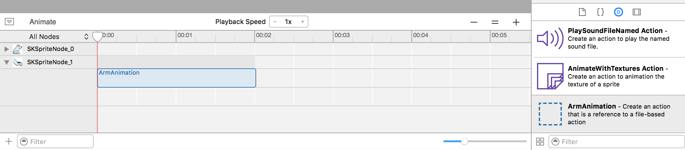
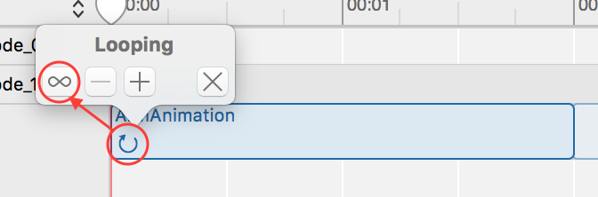
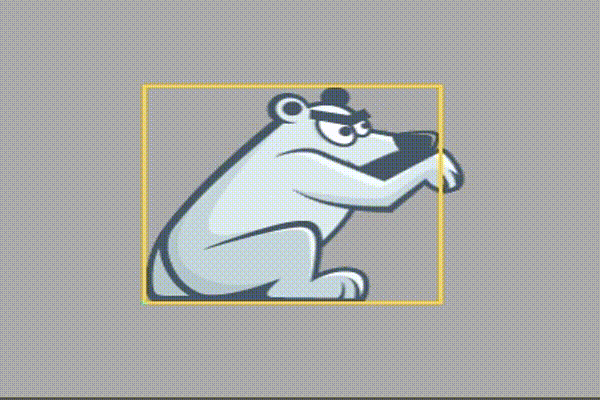

Let's learn how to create animations with SpriteKit's timeline. For our game we want to add a taunting animation to the bear that will sit behind our catapult:

#Setting up a new .sks file

The bear will have it's own .sks file.

> [action]
> Create a new file called *Bear.sks* (`File > New > File`) in your project:
>
> 

We need to combine two images to make the bear: the body without an arm, and a separate arm that will be animated.

> [action]
> Select *Bear.sks* and zoom the scene out so you can see the yellow border.
> Add *bearnoarms.png* from your *Media Library* to the scene, I recommend you hold *Shift* and snap the bear to
the bottom left corner of the scene.
>
> 

<!--  -->

> [action]
> Add *bearnoarms.png* and modify the *Anchor Point* to `(0,1)`, position it somewhere that looks good.
> Set the *Z* to `1` to ensure the arm is always on top.
>
> 

We need to set the anchor point of the arm because we are going to rotate it. When we apply a rotation to a *SKNode* it rotates around its anchor point - for the arm, this should be somewhere near the shoulder, which is the top left corner of our image.

> [info]
> If you are wondering why the yellow scene size border is different than yours, I like to set the scene size to be the width of the asset.  > When using an *Anchor Point* of `(0,0)` (Bottom Left) it doesn't really matter.  Typically the *Anchor Point* is `(0.5,0.5)` and it helps
ensure positioning is as you expect when dropped into another scene.

#Setting the animation up

Now we can animate the polar bear's arm. In SpriteKit there is a default timeline for adding animation actions.  However, you are going to use a more powerful feature and create shared animation timelines which are stored in a *SpriteKit Action* file, this gives you the power to reuse animations across all nodes. It is good practice to name the timeline like the animation happening on it.

> [action]
> Click on *+* to add a new timeline and name it `ArmAnimation`, when prompted to create a new file name it `CharacterActions`.
>
> 

##Adding actions

We will animate the arm using two rotation actions, the first one will rotate the arm by 90 Degrees and the second will rotate it back
by 90 Degrees.  Unfortunately SpriteKit doesn't allow us to easily preview this animation.

> [action]
> You should be in *CharacterActions.sks*, expand *ArmAnimation* and locate the *Rotate* action in the *Object library*.
> Drag this into the timeline, the default values of *Duration* `1` and *Degrees* `90` works well.
> Drag another rotation in and set the *Degrees* to `-90`
>
> 

Congratulations! Let's try this out on our Bear.

##Using custom actions

> [action]
> Open *Bear.sks* then have a look in your *Object Library* you should see your recently created custom action `ArmAnimation`.
> Drag this into the timeline for the arm, ensure the duration is `00:02` by dragging the width of the `ArmAnimation`.
>
> 
>
> Next we want to ensure this animation loops forever, click on the loop symbol in the bottom left of your action and select
> the infinity symbol.
>
> 

Great job, time to press *Animate* at the top of the timeline editor and your bear should hopefully look like this:

#Summary

You learnt to create a reusable timeline action animation and apply this to your newly created bear game object. In the next section we
will be adding more reusable game objects.
