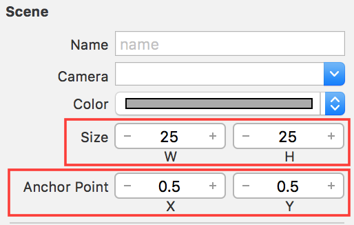
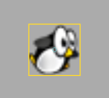
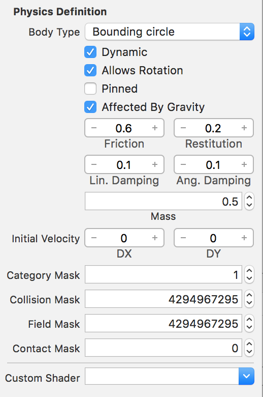
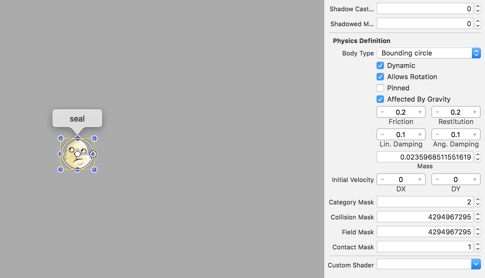
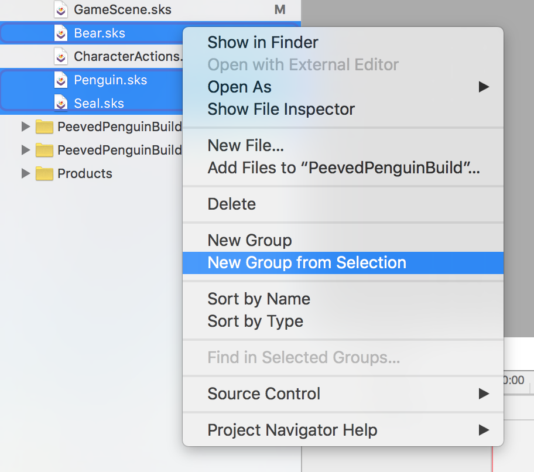

Seals are the big bad in Peeved Penguins. The goal is to crush all of them! You launch penguins at them to get rid of them.

Next step is to create the Seal and Penguin objects in SpriteKit.

#Creating the penguin scene

The penguins and seals will each get their own *SKS* files as they will reusable objects in the game scene.  You will be using them in both the Scene Editor and in your code.

> [action]
> Create a new SKS file (`File > New > File > SpriteKit Scene`) and name it `Penguin.sks`.
>
> Drag the *flyingpenguin.png* asset into scene, set the *Scene Size* to `(25,25)` which is the size of the *flyingpenguin.png* asset and set the *Anchor Point* of the scene to `(0.5,0.5)`.  
>
> 
>
> Snap the penguin to the center of the scene.
>
> 
>

The penguin is nearly ready for action, this is a physics based game so the penguin will need to be physics enabled.  If you look at the shape of the penguin it's practically a ball.... The ideal physics projectile body :]

##Enabling physics

> [action]
> Click on the penguin is  and set the *Physics Definition* :
>
> 
>
> You're setting the *Friction* to `0.6` although the penguin will be smashing into ice blocks you want to ensure it doesn't slide around too much.  There is always a fine balance between realism and fun.
> The *Mass* has been increased to `0.50` as the penguin should act as more of a cannon ball than a fluffy penguin.
> The *Category Mask* is set to `1` as this will be the first physics group.

For more information relating to *Physics Masks* please see the *Hoppy Bunny Tutorial*.

<!-- -->

> [info]
> You may wonder, where did these values come from? Did I run the simulation in my head?
>
> Trial and error, the key to a fun physics simulation is lots of tweaking. Don't worry it's a normal part of game development. Getting the balance right can be the difference between great and mediocre.

##Accessing the penguin

There is one not so obvious issue you need to deal with, if you drag the penguin into the *GameScene* an *SKReferenceNode* will be created, it's important to note this is a reference to the *Penguin.sks* scene and not the actual penguin sprite itself.  However, we need to be able to easily access the penguin's physics body for use with the launcher.

Thankfully we've already created a handy sub-class of *SKReferenceNode* called *MSReferenceNode* that will let you access the penguin sprite inside the penguin scene.

> [action]
> [Download MSReferenceNode.swift](https://github.com/MakeSchool-Tutorials/Peeved-Penguins-SpriteKit-Swift-Solution/raw/master/PeevedPenguinBuild/MSReferenceNode.swift) and add it to your project. As always have a peek at the code.

You will be making use of the class in later chapters, it's important to set the *Name* of the sprite in the scene you require access.

> [action]
> Click on the penguin and set the *Name* property to `avatar`

More on this later.

Time to add the bad guys! The process of creating the seal will be very similar to that of the Penguin.

#Creating the seal scene

The process to add our cute but evil seals is very similar to the penguin.

> [challenge]
> See how far along you can get setting up the *Seal.sks*, no peeking at the solution :]
>

<!-- -->

> [action]
> Create a new SKS file (`File > New > File > SpriteKit Scene`) and name it `Seal.sks`.
>
> Drag in the *seal.png* asset to the new scene, set *Scene Size* to `(27,25)` which is the size of the seal asset and set *Anchor Point* of the scene to `(0.5,0.5)`.  
>

##Seal physics

Imagine the seal will act like a pin in ten-pin Bowling and the penguin will act as the bowling ball.

> [action]
> Time to setup the physics body, the default values are pretty close to what you want, the only real difference  you need to set the *Category Mask* and *Contact Mask*.
>
> Ensure the seal is selected and setup the *Physics Definition* as shown:
> 
>
> The penguin has already taken the first *Category Mask* of `1` so the next logical category you can use will be `2` for the seal.
>
> You will also want to be alerted when the seal is involved in a collision with the penguin so you set the *Contact Mask* to `1`.
>

That's it! You now have the core reusable game objects ready for action.

#Organization

Now that you have a few game files, it's a good idea to keep your project files organized.
I would suggest moving the new game objects into their own *Group* as shown:

Call it whatever helps you relate.  These groups are virtual folders and do not affect the underlying file structure. You can *right click* any file and select `Show in Finder` to see where it sits on your Mac.

#Summary

You learnt to:

- Create reusable core game objects
- Setup physics properties and tweak values
- Use a custom class for the scene

In the next chapter you will be building the first thing the player typically sees, the main menu.
