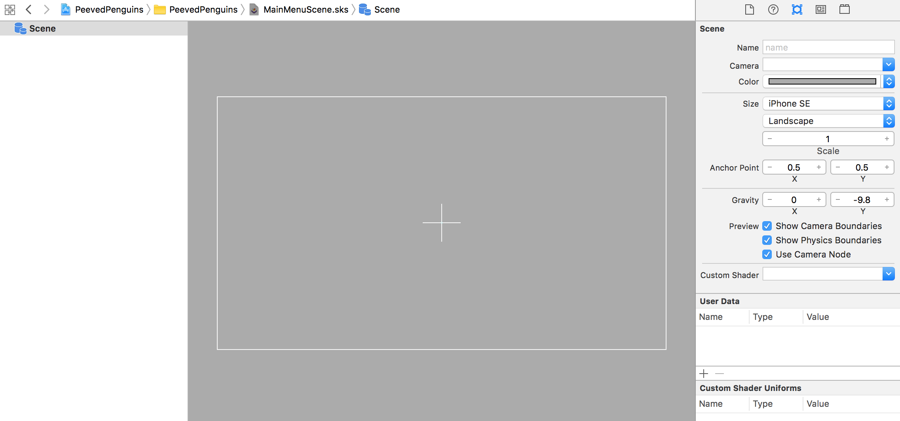
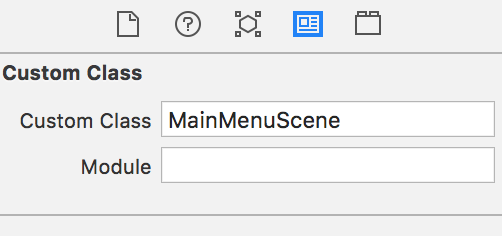

You are going to build the main menu scene. The main menu will lead the player into the gameplay scene that you will develop in the next chapter. Also this is great place to add game options :]

# The Main Scene

> [action]
> Create a new SKS file (`File > New > File > SpriteKit Scene`), set *Name* to `MainMenuScene.sks`
> Set *Size* to `iPhone SE`
> 
>
> Set *Custom Class* to `MainMenuScene`
> 

## Add a background

> [action]
> Drag *menubackground.png* onto the scene and snap it to the center.

# Add a play button

The main menu needs a play button to trigger the player's transition to the *GameScene*.
SpriteKit does not provide any native button nodes, so you need to roll your own.  You may recall
the *MSButtonNode* class we provided in the *Hoppy Bunny* tutorial.  If you took on the challenge to build a better button please show it off and add to your project.

If you need the original button, please [Download MSButtonNode.swift](https://raw.githubusercontent.com/MakeSchool-Tutorials/Peeved-Penguins-SpriteKit-Swift-Solution/master/PeevedPenguinBuild/MSButtonNode.swift) and drag the file into your project, ensuring *Copy items if needed* is checked.


> [action]
> Drag *button.png* into the scene, place it wherever looks great to you.
> You will be creating a code connection for this node later so set *Name* to `buttonPlay`.
> Set *Custom Class* to `MSButtonNode`:
>
> 
>

# Adding the companion code

To make the button work you will need some code to to perform the scene transition to the game scene

> [action]
> Create a new empty Swift file (`File > New > File > Swift File`), set *Name* to `MainMenuScene.swift`
> Replace the contents of this file with the following code:
>
```
import SpriteKit
>
class MainMenuScene: SKScene {
>    
    /* UI Connections */
    var buttonPlay: MSButtonNode!
>    
    override func didMove(to view: SKView) {
        /* Setup your scene here */
>        
        /* Set UI connections */
        buttonPlay = self.childNode(withName: "buttonPlay") as! MSButtonNode
>        
        /* Setup button selection handler */
        buttonPlay.selectedHandler = {
>            
            if let view = self.view {
>                
                // Load the SKScene from 'GameScene.sks'
                if let scene = SKScene(fileNamed: "GameScene") {
>                    
                    // Set the scale mode to scale to fit the window
                    scene.scaleMode = .aspectFill
>                    
                    // Present the scene
                    view.presentScene(scene)
                }
>                
                // Debug helpers
                view.showsFPS = true
                view.showsPhysics = true
                view.showsDrawCount = true
            }
        }
>        
    }
}
```
>

This code creates the code connection for the button and sets up the *selectedHandler* to launch your *GameScene* when the button is touched.  

## Default scene

Although the *MaineScene.sks* is displayed, it's not connected to your *MainScene.swift*. This is easily rectified.

> [action]
> Open `GameViewController.swift`, and replace:
>
```
if let scene = SKScene(fileNamed: "GameScene") {
```
> with:
>
```
if let scene = SKScene(fileNamed: "MainMenuScene") {
```
>

Finally time to run your game...

You should be presented with your *MainMenuScene*, be able to to touch the **Play** and be presented with the *GameScene*.  Good job :]


# Summary

You've learnt to:

- Implement multiple scenes
- Change the default launch scene
- Add a custom button and present a new scene

In the next chapter you start to build the game scene.
