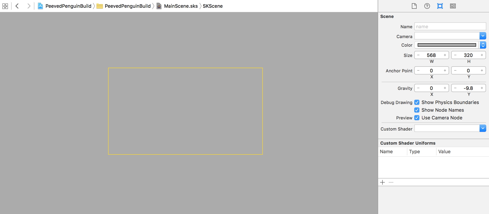
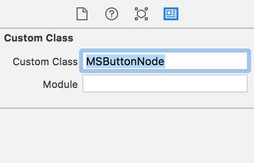
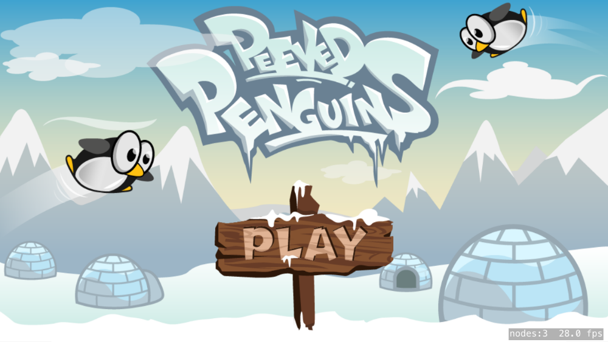
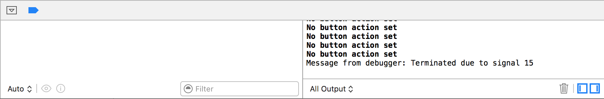

Now you are going to setup the essential main menu screen. That start menu will then lead the player into the gameplay scene that you will develop in the next chapter.

#Adding the Main Scene

You are going to create a new *Scene* for the main menu.

> [action]
> Create a new SKS file (`File > New > File > SpriteKit Scene`) and name it `MainScene.sks`
> Set *Scene Size* to `(568,320)`
>
> 

##Adding the background

> [action]
> Drag *menubackground.png* to the scene and snap it to the bottom-left corner.
> Set *Z-Position* to `-1` to ensure the background is always at the back.

#Creating the play button

The main menu needs a play button to trigger the transition into the *GameScene*.

> [action]
> SpriteKit does not provide any button objects, so you will need to use our assets as you did in the *Hoppy Bunny Tutorial*.
> Drag *button.png* into the scene, place it wherever looks good to you.
> You will need to create a code connection to link this button to your code so set the *Name* to `buttonPlay`, you will also need to set the *Custom Class* to `MSButtonNode`:
>
> 
>

If you've improved the *MSButtonNode* class in the *Hoppy Bunny Tutorial* and made it epic.  Please feel free to reuse it in this project.

> [action]
> [Download MSButtonNode.swift](https://github.com/MakeSchool-Tutorials/Peeved-Penguins-SpriteKit-Swift/raw/master/MSButtonNode.swift) and drag the file into your project, ensuring *Copy items if needed* is checked.

Run the game...

#Launching the Main Scene

Where's the shiny new menu?
By default a new game project will load the *GameScene*, you need to change this to *MainScene*.

> [action]
> Open *GameViewController.swift* and modify the following line:
>
```
if let scene = GameScene(fileNamed:"GameScene") {
```
> Replace with:
```
if let scene = GameScene(fileNamed:"MainScene") {
```

Run your game...



Looks good, you can even touch the button.  However, it doesn't do anything other than print out the following in the debug console:



##Coding the main scene

Let's add a new partner *MainScene.Swift* file to facilitate functionality for *MainScene.sks*.

> [action]
> Create a new empty Swift file (`File > New > File > Swift File`) and name it `MainScene.swift`
> Ensure your new class reads as follows:
>
```
import SpriteKit
>
class MainScene: SKScene {
>    
    /* UI Connections */
    var buttonPlay: MSButtonNode!
>    
    override func didMoveToView(view: SKView) {
        /* Setup your scene here */
>        
        /* Set UI connections */
        buttonPlay = self.childNodeWithName("buttonPlay") as! MSButtonNode
>        
        /* Setup restart button selection handler */
        buttonPlay.selectedHandler = {
>            
            /* Grab reference to our SpriteKit view */
            let skView = self.view as SKView!
>          
            /* Load Game scene */
            let scene = GameScene(fileNamed:"GameScene") as GameScene!
>            
            /* Ensure correct aspect mode */
            scene.scaleMode = .AspectFill
>            
            /* Show debug */
            skView.showsPhysics = true
            skView.showsDrawCount = true
            skView.showsFPS = true
>            
            /* Start game scene */
            skView.presentScene(scene)
        }
>
    }
>
}
```
>

This code creates the code connection for the button and sets up the *selectedHandler* to launch your *GameScene* when the button is touched.  

Run the game... Oh it doesn't work?

##Initializing the Main Scene

Although the *MaineScene.sks* is displayed, it's not connected to your *MainScene.swift*. This is easily rectified.

> [action]
> Open `GameViewController.swift`, remember this line:
>
```
if let scene = GameScene(fileNamed:"MainScene") {
```
> Replace with:
>
```
if let scene = MainScene(fileNamed:"MainScene") {
```
>

Run the project...

You should now be able to touch the **Play** button and be presented with an empty *GameScene*.

#Summary

You've learnt to:

- Implement multiple scenes
- Change the default launch scene
- Create a custom button and launch another scene

In the next chapter you will building the game scene.
