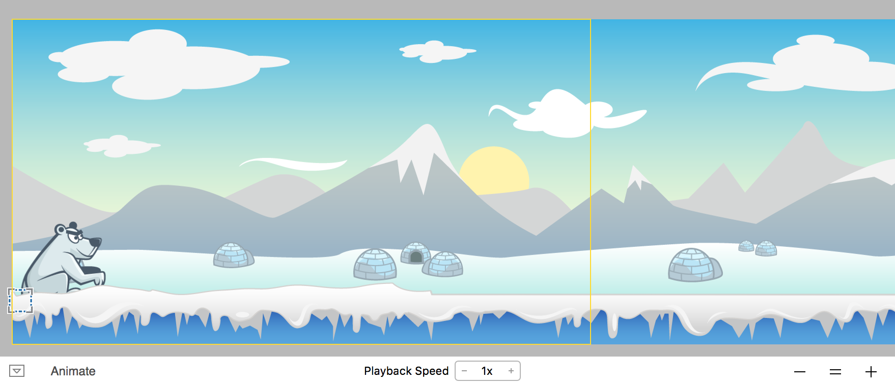
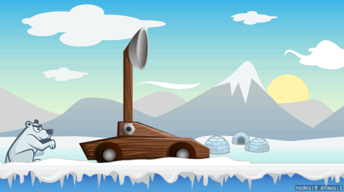
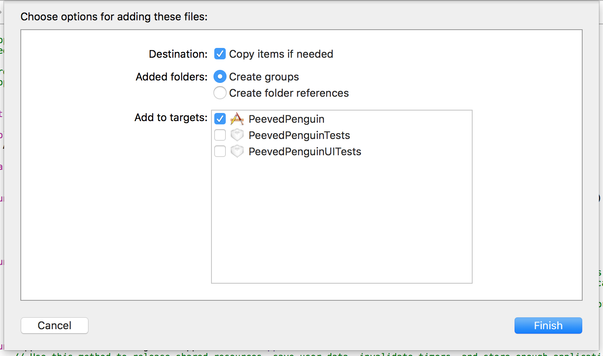
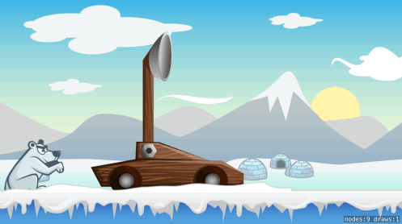
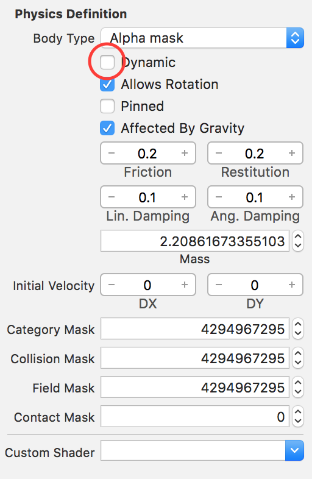
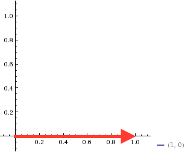
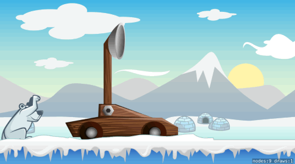

Now it's time to start working on the good stuff, you're going to construct *Penguin Launcher 0.1 Beta*

#Setup the game scene

> [action]
> Open *GameScene.sks* and set *Size* to `(568,320)`
> Drag *background.png* onto the stage, snap to the bottom-left and set the *Z-Position* to `-1`
> Drag *ground.png* onto the stage, snap to the bottom-left and set the *Z-Position* to `2`, you want the ground to be in the foreground as some objects such as the catapult will sit between the ground and the background
>

Remember the first game object you made? You will be adding the animated *Bear.sks* to the scene. SpriteKit lets you reference **.sks** files in other **.sks** files using a *SKReferenceNode*. This is a **super powerful** feature, and you will make extensive use of it.

> [action]
> Open *GameScene.sks* and drag the *Bear.sks* from the *Project Navigator* and place it on top of the ground near the bottom-left.
> You will most likely need to do a quick *Save* of the *GameScene* to have the bear sprite show up in the *SKReferenceNode*.

You should have something that hopefully looks a lot like this:



Click on the **Animate** button to see your bear taunting.

##Adding a catapult

> [action]
> Drag *catapult.png* to the stage and set the *Z-Position* to `1` as you want the arm to sit behind the main body of the catapult.
> Drag *catapultArm.png* to the stage and set *Name* to `catapultArm` as you will want to create a code connection for the arm later.
>

Run your game...



#Penguin launcher model 1

Before modeling catapult physics we are going to implement a simple shooting mechanism to learn a bit more about projectile physics.

> [info]
> SpriteKit doesn't include any handy vector maths libraries out of the box, thankfully the internet tends provide :]
> There is a handy collection of helper classes and functions called [SKTUtils](https://github.com/raywenderlich/SKTUtils), we've updated these to Swift 2.1 so please [Download SKTUtils.zip](https://github.com/MakeSchool-Tutorials/Peeved-Penguins-SpriteKit-Swift/raw/master/SKTUtils.zip), unzip it and drag into to your project.
> Remember to check the import options as shown:
> 
>

Time for you to connect the catapult arm, spawn penguins and launch them into the stratosphere.

> [action]
> Open *GameScene.swift* and replace the contents with:
>
```
import SpriteKit
>
class GameScene: SKScene {
>    
    /* Game object connections */
    var catapultArm: SKSpriteNode!
>    
    override func didMoveToView(view: SKView) {
        /* Set reference to catapultArm node */
        catapultArm = childNodeWithName("catapultArm") as! SKSpriteNode
    }
>    
    override func touchesBegan(touches: Set<UITouch>, withEvent event: UIEvent?) {
        /* Add a new penguin to the scene */
        let resourcePath = NSBundle.mainBundle().pathForResource("Penguin", ofType: "sks")
        let penguin = MSReferenceNode(URL: NSURL (fileURLWithPath: resourcePath!))
        addChild(penguin)
>        
        /* Move penguin to the catapult bucket area */
        penguin.avatar.position = catapultArm.position + CGPoint(x: 32, y: 50)
    }
>    
    override func update(currentTime: CFTimeInterval) {
        /* Called before each frame is rendered */
    }
>    
}
>
```
>

You're creating a instance of the *Penguin.sks* scene using the custom *MSReferenceNode* class. This subclass lets you access the penguin sprite inside the *Penguin.sks* through the *avatar* property.  
To position the penguin, you take the position of the catapultArm and add a *Position* of `(32,50)` pixels to place the penguin roughly inside the catapult bucket area.

Run your game...



Great, the penguin spawns at the catapult but sadly falls out of the game world.

##Ground physics

Let's enable physics on the **ground** to add some physicality, can you set this up?

> [solution]
> The ground will be a static physics body and you want to ensure an accurate shape.
> Set *Body Type* to `Alpha` this is a great option for complex shapes and it will accurately create a body that follows the contours of the ground.  
> Your physics setup should look like this:
> 
>

Run your game... It's a bit more fun, see how many penguins you can add? :]

##Adding a little impulse

It would be nice to add a little impulse to the penguin. Imagine the penguin is being hit by an invisible baseball bat.

> [action]
> Add the following to the end of the `touchesBegan(...)` method:
>
```
/* Impulse vector */
let launchDirection = CGVector(dx: 1, dy: 0)
let force = launchDirection * 10
>
/* Apply impulse to penguin */
penguin.avatar.physicsBody?.applyImpulse(force)
```
>

First your setup the force vector with a direction `(1,0)` e.g X = 1 (Right)

> [info]
> If you need a little recap on vectors, this diagram illustrates the direction of the vector `(1,0)`
>
> 
>

Next you multiply this by `10` to ensure you hit the penguin with enough force to make it fly!
Please feel free to play with these values.

Run your game... Your penguins should hopefully fly across the screen now.



#Summary

Your game is starting to come to life, you've learnt to:

- Build a simple game scene
- Construct a simple catapult
- Dynamically add new penguins to the scene
- Apply impulse in a specific direction to launch the penguin

In the next chapter you will design your first game level.
