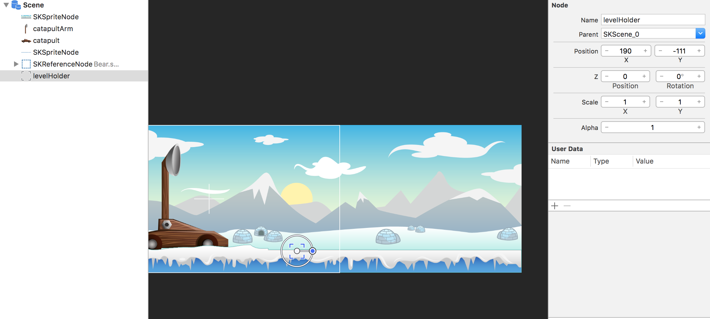
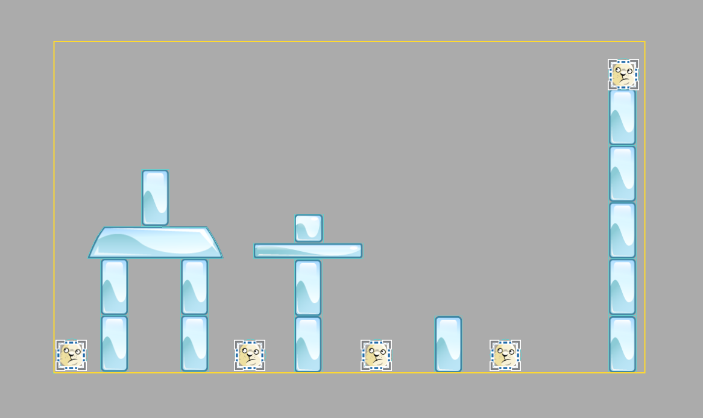
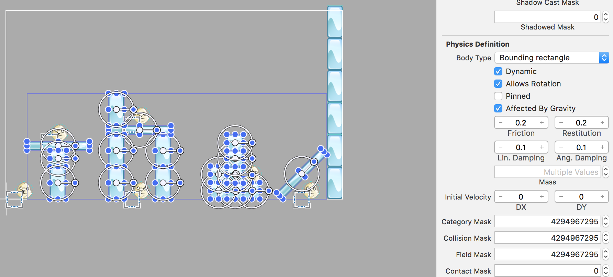
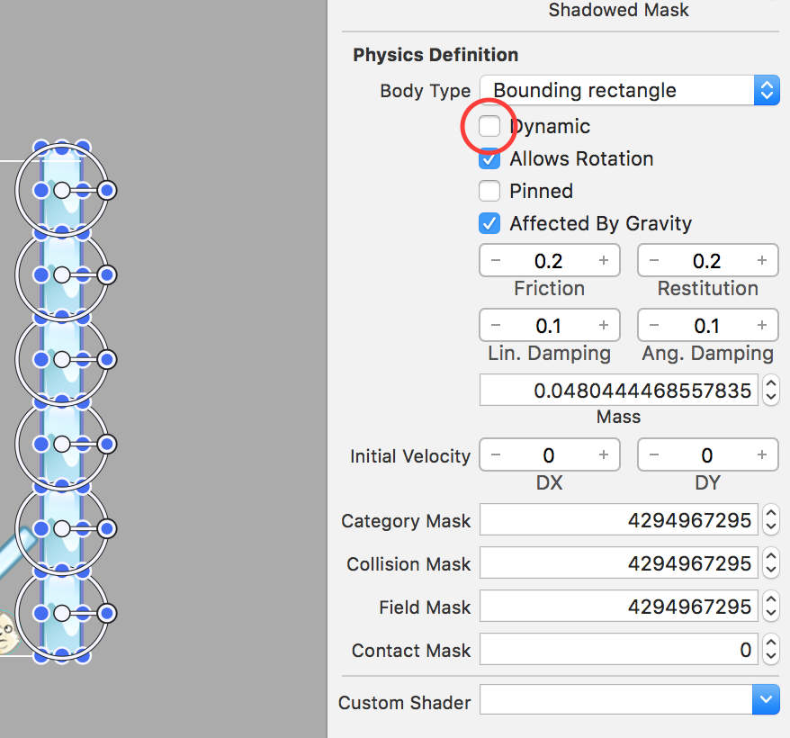
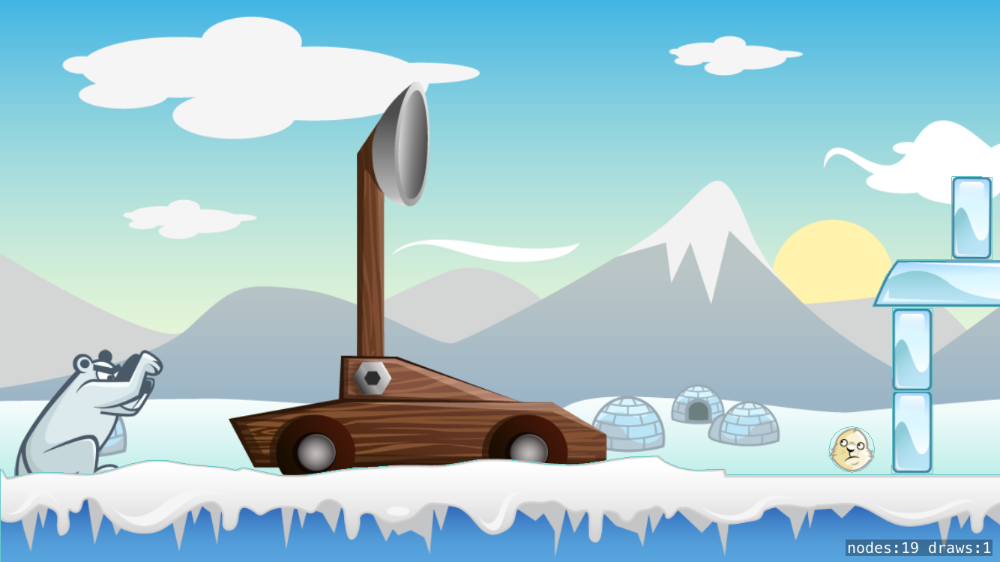
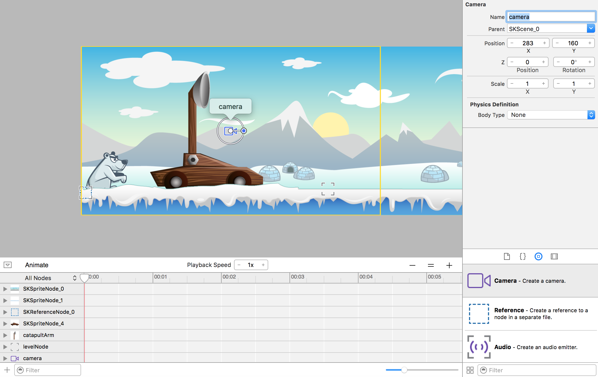
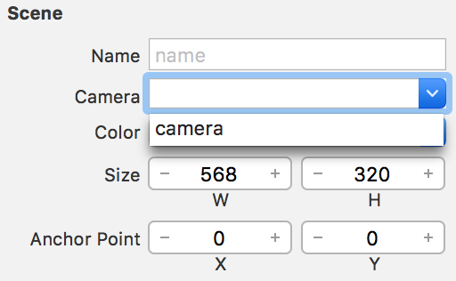
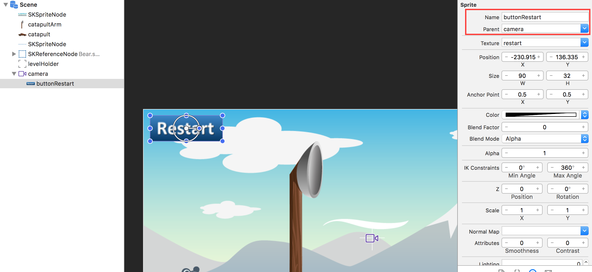

Launching penguins is a mechanic, smashing seals and ice blocks is a game.
Time to design your first level.

# Level loading

Now let's solve the first puzzle. **Problem:** You want to be able to have the potential for unlimited levels in your game. Therefore you don't want the game mechanics (shooting, collision detection, etc.) to be part of the level itself.  Otherwise you would be in big trouble if you wanted to change your mechanics.  You would need to apply the changes to every level. Which isn't going to be much fun at all.

This means you are not going to hard code a level directly into your *GameScene.sks*. A better solution is to define an area in the *GameScene.sks* that is reserved for level design and load a level node into that area.

## Level node

> [action]
> Drag an *Empty Node* into the stage, set *Position* to `(190,-111)``
> 

This node will be the container for the level you will be creating. The actual loading mechanic will happen in code, you will need to create a code connection to this node to make it accessible to the *GameScene* class.

> [action]
> Set *Name* to `levelHolder`

<!-- -->

> [challenge]
> Create a code connection for the `levelHolder` node in *GameScene.swift*

# Designing a level

> [action]
> Create a new SKS file (`File > New > File > SpriteKit Scene`), set *Name* to `Level1.sks`
> Set *Size* to `Custom - (490,275)`
> Set *Anchor Point* to `(0,0)`
>

Time to design your very first level, drag in any of the *block* assets and drag a few *Seal.sks* onto the stage and create your own unique design :]

> [info]
> Design tip: Put an asset close to the left edge of the scene, that way the player will be able to see a hint of the level to come.

You need to enable physics on all of the blocks if you want them to be part of the physics simulation.
Thankfully you can `Hold Cmd` and select each node and then set the *Physics Definition* properties for the group.

Here is one I made earlier:


> [action]
> Select your blocks and set *Body Type* to `Bounding rectangle`
> 

Did you notice the wall on the right hand side was not part of this setup?
That's because this wall is a static wall used to stop the penguin leaving the scene.

> [action]
> Add a wall at the edge of the level.
> Select your blocks and set *Body Type* to `Bounding rectangle`
> Uncheck *Dynamic* as this will be a static immovable wall.
> 


# Level loader

Now you are going to add a level loading mechanic.

> [action]
> Open *GameScene.swift*
> If you had any issue completing the `levelHolder` code connection challenge, here is a recap:
>
> Add this property to your class:
>
```
/* Level loader holder */
var levelHolder: SKNode!
```
>
> Add the code connection to the `didMove(...)` method:
>
```
/* Set reference to levelHolder SKNode */
levelHolder = childNode(withName: "levelHolder")
```
>

<!-- -->

> To load your level scene into the *GameScene*, add the following to the end of `didMoveToView(...)`:
>
```
/* Load Level 1 */
let resourcePath = Bundle.main.path(forResource: "Level1", ofType: "sks")
let level = SKReferenceNode (url: URL (fileURLWithPath: resourcePath!))
levelHolder.addChild(level)
```
>

This will load the *Level1.sks* scene using a *SKReferenceNode* and then the level is added
to the level holder, placing it in the game scene.

Run your game... You should see a hint of your level if you put an object near the left edge of *Level1*. You can launch the penguins but you can't see what's happening.



# Using a camera

Now that you can launch penguins, it's time to improve the experience by tracking the penguin in flight across the game world. SpriteKit features a *SKCameraNode* that lets you view a scene through a virtual camera.  However, as it stands there is no in-built functionality to follow a node so you are going to have to build your own node tracking solution for the camera.

## Add the camera

First you need to add the *SKCameraNode* to the scene.

> [action]
> Open *GameScene.sks*, drag a *Camera* onto the stage, set *Name* to `camera` and *Position* to `(0,0)` which adds it nicely to the first half of your game world.
> 
>

Great, you now have a camera that by default displays the first half of the game scene.  Before you can view the scene through the eye of the camera, you need to assign the camera to the scene.

> [action]
> Select the scene and set *camera* to `camera`.
> 
>

Run your game... Yeah it looks just the same as before :]

## Tracking a node

First up you need to have a target for the camera to follow, this would be the penguin. You will be adding a *trackerNode* property and helpers to the *GameScene* class, allowing you to track the targeted node and use the `update(...)` method to animate the camera movement.


> [action]
> Add the following properties to your *GameScene* class:
>
```
/* Tracking helpers */
var trackerNode: SKNode? {
  didSet {
      if let trackerNode = trackerNode {
          /* Set tracker */
          lastTrackerPosition = trackerNode.position
      }
  }
}
var lastTrackerPosition = CGPoint(x: 0, y: 0)
var lastTimeInterval:TimeInterval = 0
```
> At the end of the `touchesBegan(...)` method add:
>
```
/* Set tracker to follow penguin */
trackerNode = penguin.avatar
```
>

When the *trackerNode* is set to track a new object, you can implement the *didSet observer* to reset the other tracking helpers.

> [action]
> Add this to your `update(...)` method:
>
```
/* Check there is a node to track and camera is present */
if let trackerNode = trackerNode, let camera = camera {
>
    /* Calculate horizontal distance to move */
    let moveDistance = trackerNode.position.x - lastTrackerPosition.x
>    
    /* Duration is time between updates */
    let moveDuration = currentTime - lastTimeInterval
>    
    /* Create a move action for the camera */
    let moveCamera = SKAction.moveBy(x: moveDistance, y: 0, duration: moveDuration)
    camera.run(moveCamera)
>    
    /* Store last tracker position */
    lastTrackerPosition = trackerNode.position
}
>
/* Store current update step time */
lastTimeInterval = currentTime
```
>

Take a little time to read through the comments and follow the code.

Run your game... The camera will track the penguin and you can see your hand crafted level design in action.

# Restart the game

Now that the player can demolish a level, it also would be great for them to be able to restart the game. It's also very useful for testing your game, always add a restart button.

You will implement this button like you did for the *Main Menu*, by utilizing the *MSButtonNode* class.  

> [info]
> If you finding yourself needing to create button graphics, take a look at the Make School resources list.

Let's add the restart button to the *GameScene*.

> [action]
> Open *GameScene.sks* and drag *restart.png* into the stage. The `Top-Left` of the screen would be a nice position.
> Set *Name* to `buttonRestart` and set *Custom Class* to `MSButtonNode`.

Run your game... You will notice the restart button is stuck to the game scene, it would be nice to have a UI Layer that sits on top of the game scene so it's always accessible to the player.

Thankfully there is a nice shortcut you can take here, you can effectively stick the button to the camera.

> [action]
> Select *buttonRestart* and set *Parent* to `camera`.

<!-- -->

> [info]
> Remember you can also set a node's parent by using the *Scene Graph*.



Next you need to code connect the button and add a **selectedHandler** that will restart the *GameScene* when touched.

> [challenge]
> Can you do this yourself?
> **Hint:** Look at the *MainScene* `buttonPlay` implementation.

<!-- -->

> [solution]
> Open *GameScene.swift* and add the code connection property.
>
```
/* UI Connections */
var buttonRestart: MSButtonNode!
```
>
> Add the code connection to `didMove(...)`:
>
```
/* Set reference to buttonRestart SKSpriteNode */
buttonRestart = childNode(withName: "//buttonRestart") as! MSButtonNode
```
>
> Add a `selectedHandler` to restart the *GameScene* in `didMove(...)`:
>
```
/* Setup button selection handler */
buttonRestart.selectedHandler = { [unowned self] in
>
  if let view = self.view {
>      
    // Load the SKScene from 'GameScene.sks'
    if let scene = SKScene(fileNamed: "GameScene") {
>        
        // Set the scale mode to scale to fit the window
        scene.scaleMode = .aspectFill
>        
        // Present the scene
        view.presentScene(scene)
    }
>    
    // Debug helpers
    view.showsFPS = true
    view.showsPhysics = true
    view.showsDrawCount = true
  }
}
```
>

Great!

Run your game... Your **Restart button** should be fully operational.

# Summary

Congrats! This is starting to look like a real game.

You learnt to:

- Implement a dynamic level loader
- Design your first level
- Using a *SKCameraNode* to track a node
- Adding a restart button

In the next chapter you are going to learn how to take your physics to the next level and build a better  catapult.
