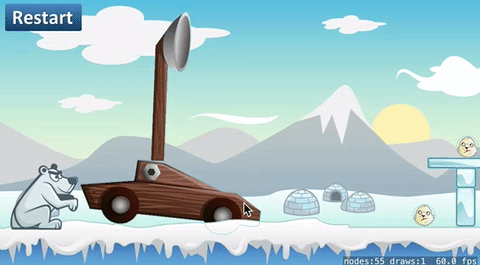

Now things are going to get real :] You will implement an improved physics catapult mechanic. Let's get started with a short introduction to the type of physics objects you will be using.

# Physics joints

You're going to add physics bodies to the catapult and the catapult arm. Unlike the other physics objects you have in your game at the moment, the catapult consists of two parts that you will need to join together.  Physics objects can be connected to each other using joints. There are a handful of joint types each with its own set of physics rules.

> [action]
> Open *GameScene.sks* and enable physics on the **catapult** and **catapultArm** . Set *Body Type* to `Alpha mask`.
>

Run your game...



The catapult falls apart because they're not connected together.  Joints will allow you to create that connection.

## Body setup

Let's revise the catapult physics bodies.

> [action]
> Select the *catapult* (Not the Arm)
> Uncheck -`Dynamic`, this makes the catapult body a static body.

Next you will remove the physics body from the *catapultArm* as you will be learning how to setup a physics body in code.

> [action]
> Select the *catapultArm*
> Set *Body Type* to `None` to remove the physics body.
>

There is sadly no support to visually create joints yet in SpriteKit, so you will have to get your hands dirty and code this yourself. However, you can use the Scene Editor to create all of the physics bodies that will be used with the joints.  Before you do this you need access to both the **catapult** and **catapultArm** in code.

You already have a code connection for the **catapultArm**.

> [challenge]
> Can you code connect the *catapult*?

<!-- -->

> [solution]
> You can do this, look at the *catapultArm* code :]

Next you are going to manually initialize the *Physics Body* for the *catapultArm*.

> [action]
> Add this code to the end of `didMove(...)`
>
```
/* Initialize catapult arm physics body of type alpha */
let catapultArmBody = SKPhysicsBody (texture: catapultArm!.texture!, size: catapultArm.size)
>
/* Mass needs to be heavy enough to hit the penguin with sufficient force */
catapultArmBody.mass = 0.5
>
/* No need for gravity otherwise the arm will fall over */
catapultArmBody.affectedByGravity = false
>
/* Improves physics collision handling of fast moving objects */
catapultArmBody.usesPreciseCollisionDetection = true
>
/* Assign the physics body to the catapult arm */
catapultArm.physicsBody = catapultArmBody
```
>

<!-- -->

> [info]
> *Remember* Apple documentation is your friend, if you are unsure of anything, highlight the method or property in question and look at the *Quick Help* description.
>

## Pin joint

Now time to create your first joint, you will be using *SKPhysicsJointPin* to connect the **catapult** and **catapultArm** together.

> [action]
> Add the following to the end of your `didMove(...)` method:
>
```
/* Pin joint catapult and catapult arm */
let catapultPinJoint = SKPhysicsJointPin.joint(withBodyA: catapult.physicsBody!, bodyB: catapultArm.physicsBody!, anchor: CGPoint(x:210 ,y:104))
physicsWorld.add(catapultPinJoint)
```
>

The *anchor* is relative to scene node, so you need to find the **position** in scene node for the pivot point on the catapult. An easy way to do this is add a *Color Sprite* to the scene and move it to the position you want to anchor on.  Make a note of the position value, set the value in code and then remove the *Color Sprite* from the scene.

Congratulations, you just added your first physics pin joint!

# Catapult spring

You need a joint that will simulate the action of a catapult launch, allowing the player to pull back on the catapult bucket and then **spring** forward, launching any projectiles that are in the bucket.

Having a look at the joint documentation, *SKPhysicsJointSpring* sounds like it would be ideal for this job. The spring length is extended by pulling back on the catapultArm, the further back the joint is pulled. The greater the energy that will be unleashed when the joint is released. This energy will drive the **catapultArm** forward.

Before you setup this joint, it's important to note that joints always require two physics bodies.  In this instance you don't have another physics body to connect to.

There is a solution...

It's common practice to create invisible static physics bodies to serve this purpose, you can use Scene Editor to create an invisible *Color Sprite* and set up a static physics body.  This will be used to provide the second body for the joint in question.

> [action]
> Drag a *Color Sprite* onto the stage and place it above the catapult arm.
> Set *Name* to `cantileverNode` (fancy catapult design terminology) :]
> Set *Size* to `(25,25)`.
> Set *Body type* to `Bounding rectangle`, uncheck the *Dynamic* box.
> 

This sets up the static physics body nicely.  However, there is an issue, by default this physics body will collide with everything in the game world.  If you recall setting up the goal sensor in the Hoppy Bunny tutorial, you can use the *Physics Masks* to remove the body from colliding.

> Set the *Category Mask* to `0`.

You will need to add a code connection for this node.

> [challenge]
> Add a code connect for the `cantileverNode` in *GameScene.swift*.

## Spring joint

Time to finally join these bodies together using a *SKPhysicsJointSpring*.

> [action]
> Append the following to `didMove(...)`
>
```
/* Spring joint catapult arm and cantilever node */
let catapultSpringJoint = SKPhysicsJointSpring.joint(withBodyA: catapultArm.physicsBody!, bodyB: cantileverNode.physicsBody!, anchorA: catapultArm.position + CGPoint(x:15, y:30), anchorB: cantileverNode.position)
physicsWorld.add(catapultSpringJoint)
>
/* Make this joint a bit more springy */
catapultSpringJoint.frequency = 1.5
```
>

# Pulling the catapult arm

Great, you have a **catapultArm** with a spring joint attached to the static **cantileverNode**.  
How will the player pull the **catapultArm** back to create the energy in the spring joint ready to be unleashed upon the penguin?

## Dragging concept

Here's a short outline of what you are going to do:

- When the player touches the **catapultArm**, create a **springJoint** between a dynamic **touchNode** and the **catapultArm**
- Whenever the touch moves, update the position of the **touchNode**
- When the touch ends, destroy the joint between the **touchNode** and the **catapultArm** so the **catapultArm** snaps back to it's original position and launches the penguin into the air

It's often easier to understand when you see physics in action, there's a lot going on here so make sure you pay attention. As I'm sure you already are :]

## Add the touch node

> [action]
> The easiest way to create the *touchNode* is to *Copy* & *Paste* the *cantileverNode*, rename it to `touchNode` and place it behind the catapult arm.
>
> 
>

The *touchNode* will require a code connection.

> [challenge]
> Code connect the *touchNode*.

Just in case, let's double check the code connections so far in this section:

> [action]
> You should have these properties in *GameScene.swift*
>
```
var catapultArm: SKSpriteNode!
var catapult: SKSpriteNode!
var cantileverNode: SKSpriteNode!
var touchNode: SKSpriteNode!
```
>
> And the subsequent code connections in `didMove(...)`:
>
```
catapultArm = childNode(withName: "catapultArm") as! SKSpriteNode
catapult = childNode(withName: "catapult") as! SKSpriteNode
cantileverNode = childNode(withName: "cantileverNode") as! SKSpriteNode
touchNode = childNode(withName: "touchNode") as! SKSpriteNode
```
>

## Dynamic joints

Next you will be dynamically creating a spring joint whenever the player touches the catapult arm to initiate pulling back the catapult. It needs to be accessible to your class so that when the player lets go of the catapult arm you can destroy the joint, which in turn releases the catapult arm and sets everything in motion.

> [action]
> Add this property to the *GameScene* class:
>
```
/* Physics helpers */
var touchJoint: SKPhysicsJointSpring?
```
>

# Touch control

Next you will work on the touch mechanic and implement the following:

- Touch detection on the catapult arm
- Creating a spring joint between a static body and the catapult arm
- Moving the static body as the player moves their finger, to pull back the catapult arm
- Releasing the spring joint when the player removes their finger

> [action]
> Replace the code in `touchesBegan(...)` with:
>
```
/* There will only be one touch as multi touch is not enabled by default */
for touch in touches {
>
   /* Grab scene position of touch */
   let location    = touch.location(in: self)
>   
   /* Get node reference if we're touching a node */
   let touchedNode = atPoint(location)
>   
   /* Is it the catapult arm? */
   if touchedNode.name == "catapultArm" {
>       
       /* Reset touch node position */
       touchNode.position = location
>       
       /* Spring joint touch node and catapult arm */
       touchJoint = SKPhysicsJointSpring.joint(withBodyA: touchNode.physicsBody!, bodyB: catapultArm.physicsBody!, anchorA: location, anchorB: location)
       physicsWorld.add(touchJoint!)
>
   }
}
```
>

When the player touches the screen, the **touchNode** will be set to the touch location position and a *SKPhysicsJointSpring* will be added, joining the **touchNode** and the **catapultArm** to implement the first step in the pullback mechanic.

## Pull back

To pull the catapult arm you need the **touchNode** to follow the player's touch.  You can implement this in the *touchesMoved* method.

> [action]
> Add the `touchesMoved` method to the *GameScene* class:
>
```
override func touchesMoved(_ touches: Set<UITouch>, with event: UIEvent?) {
  /* Called when a touch moved */
>
  /* There will only be one touch as multi touch is not enabled by default */
  for touch in touches {
>      
      /* Grab scene position of touch and update touchNode position */
      let location       = touch.location(in: self)
      touchNode.position = location
>      
  }
}
```
>

Run the game... You can now touch the catapult arm and pull it back.

## Let it go

There is one last step required, when the player releases their touch, you need to remove the **touchJoint**.  This will release the joint coupling the catapult arm and **touchNode**, in turn allowing the energy stored in the **cantileverNode** spring joint to be released and the arm spring forward.

> [action]
> Add the `touchesEnded` method to your *GameScene* class
>
```
override func touchesEnded(_ touches: Set<UITouch>, with event: UIEvent?) {
  /* Called when a touch ended */
>
  /* Let it fly!, remove joints used in catapult launch */
  if let touchJoint = touchJoint {
    physicsWorld.remove(touchJoint)
  }
}
```
>

Run your game... You should have a working physics based catapult model, a great improvement on your first launcher design.


# Summary

Great! Now you are really close to completing the shooting mechanism. You've covered a lot of ground here, don't worry if you don't 'get it' straight away.  The best way to get more familiar with game physics is to experiment, experiment, experiment.

You've learnt to:

- Use *SKPhysicsJointPin* to stick bodies together
- Use *SKPhysicsJointSpring* to create tension between physics bodies
- Add static physics bodies to facilitate complex joint connections
- Dynamic joint creation
- Touch mechanics

In the next chapter you will be adding the penguin to catapult.
